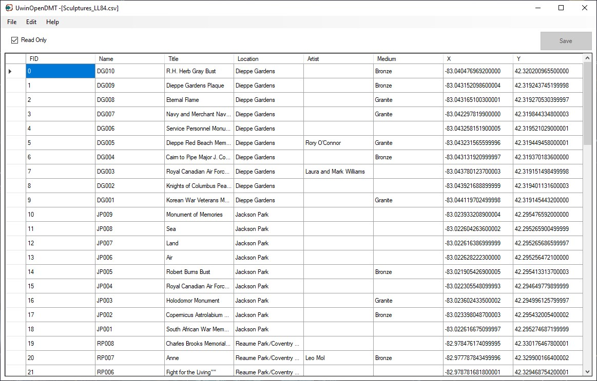
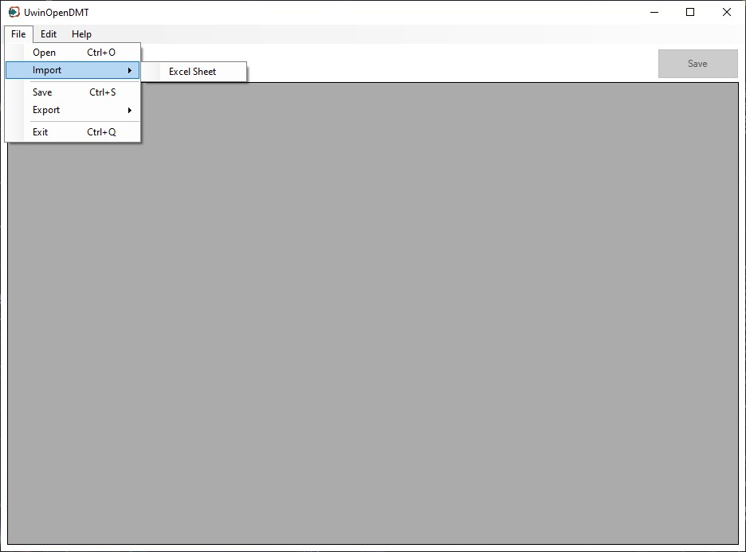
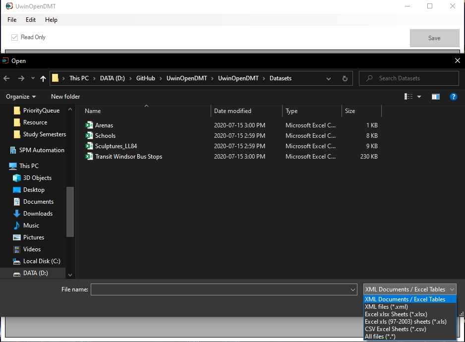
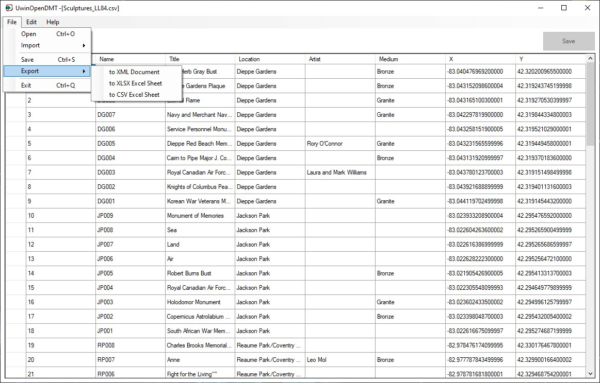

# UwinOpenData

# UwinOpenDMT
**UwinOpenDMT**   is an open data management tool which helps to import csv, xml and excel files to view, modify and delete data.

A simple `XML`, `XLSX`, `XLS` & `CSV` Documents reader that displays the result to a table `DataGridView`, allowing the user to easily manipulate the simple Document and export it to either one of those file formats or to an existing database table.

## Screenshots

**Application Loaded with Dataset** 

   

**Import Options** 

   

**Open Dialog Filters** 

   

**Export Options** 

   

> Future support : SQL Server Database
